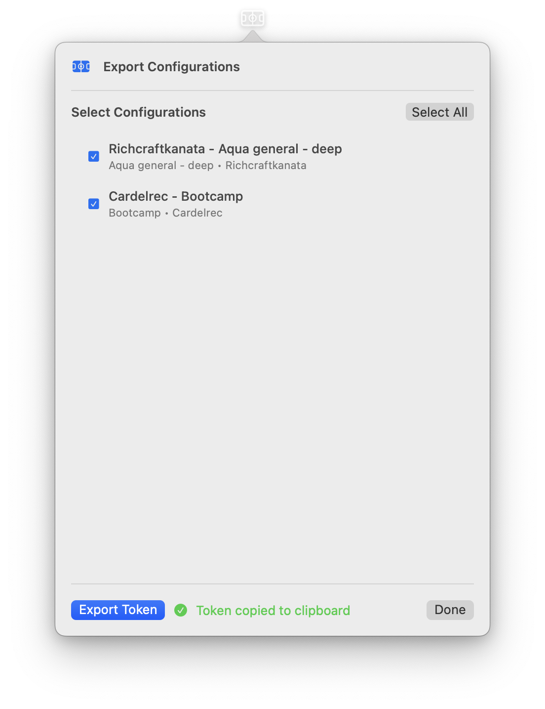

# ODYSSEY CLI Documentation

The ODYSSEY Command Line Interface (CLI) provides remote automation capabilities for running reservations without the GUI, perfect for CI/CD pipelines and server environments.

## 🎯 Overview

ODYSSEY is a **dual-interface application**:

- **🖥️ GUI Version**: Native macOS menu bar app with SwiftUI interface
- **💻 CLI Version**: Command-line interface for remote automation

Both versions use the same powerful WebKit automation engine, ensuring consistent behavior and reliability.

## 🚀 Quick Start

### 📋 Prerequisites

See [REQUIREMENTS.md](REQUIREMENTS.md) for complete system requirements.

### ⚙️ Installation

See [INSTALLATION.md](INSTALLATION.md) for detailed installation instructions.

### 🎯 Basic Usage

```bash
# Set your export token
export ODYSSEY_EXPORT_TOKEN="<exported_token>"

# Run all enabled configurations
./odyssey-cli run
```

## 📋 Environment Variables

| Variable               | Required | Default | Description                                                  |
| ---------------------- | -------- | ------- | ------------------------------------------------------------ |
| `ODYSSEY_EXPORT_TOKEN` | ✅ Yes   | -       | Export token from GUI containing configurations and settings |

### ⚙️ Example Environment Setup

```bash
# Required: Your export token from the GUI
export ODYSSEY_EXPORT_TOKEN="<exported_token>"

# CLI always runs in headless mode (no browser window)
```

## 🛠️ Commands

### ▶️ `run [--now] [--prior <days>]`

Run real reservations for configurations scheduled N days before reservation day using the same automation engine as the GUI app.

```bash
# Run configurations at scheduled time (6:00 PM, 2 days before event)
./odyssey-cli run

# Run configurations immediately (ignore time checks, usually for debugging)
./odyssey-cli run --now

# Run 1 day before reservation (usually for debugging)
./odyssey-cli run --prior 1
```

**Features:**

- ✅ **Real Automation**: Uses the same WebKit automation as the GUI app
- ✅ **Parallel Execution**: Runs multiple reservations simultaneously
- ✅ **Headless Mode**: Always runs without browser window (perfect for CI/CD)
- ✅ **Progress Tracking**: Shows real-time progress and status updates
- ✅ **Error Handling**: Displays detailed error messages if reservation fails
- ✅ **Timeout Protection**: 5-minute timeout to prevent hanging

### 📋 `configs`

List all available configurations from the export token.

```bash
./odyssey-cli configs
 Available Configurations:
==================================================
1. ✅ Richcraftkanata - Aqua general - deep
   Sport: Aqua general - deep
   Facility: Richcraftkanata
   People: 1
   Time Slots:
     Tue: 9:30 AM

2. ✅ Cardelrec - Bootcamp
   Sport: Bootcamp
   Facility: Cardelrec
   People: 1
   Time Slots:
     Tue: 7:00 AM
```

### ⚙️ `settings [--unmask]`

Show user settings from export token.

```bash
# Show masked settings (default)
./odyssey-cli settings
📋 User Settings:
==================================================
Name: John
Phone: ***890
Email: ***@domain.com
IMAP Password: ***
IMAP Server: imap.domain.com

# Show unmasked settings (for debugging)
./odyssey-cli settings --unmask
📋 User Settings:
==================================================
Name: John
Phone: 1234567890
Email: johndoe@gmail.com
IMAP Password: my-s3cur3-p@ssw0rd
IMAP Server: imap.gmail.com
```

### ❓ `help`

Show CLI help and usage information.

```bash
./odyssey-cli help
```

### 📊 `version`

Show CLI version information.

```bash
./odyssey-cli version
```

## 🔧 Export Token Details

The export token is a compressed, base64-encoded configuration optimized for CLI automation. It contains only essential data:

### ✅ Included Data:

- **User Settings**: Name, phone, email credentials, IMAP server (do not share this data, it contains sensitive information)
- **Selected Configurations**: All reservation configurations chosen for export

## 🧪 Verifying Your Configuration

### 📋 Step 1: Generate Export Token

1. Open the ODYSSEY GUI app
2. Click "Export" in the main view
3. Select the configurations you want to export
4. Click "Export Token"
5. The token will be copied to your clipboard

<div align="center">
  
</div>

### ⚙️ Step 2: Set Environment Variable

```bash
export ODYSSEY_EXPORT_TOKEN="<exported_token>"
```

### ✅ Step 3: Verify the Configuration

```bash
# List available configurations
./odyssey-cli configs

# Show user settings
./odyssey-cli settings

# Run all configurations
./odyssey-cli run
```

## 🔄 CLI Integration

### 🚀 GitHub Actions Integration

The CLI can be integrated into GitHub Actions for automated reservation booking.

#### 📋 Step 1: Fork the Repository

1. **Fork ODYSSEY**: Go to [https://github.com/Amet13/ODYSSEY](https://github.com/Amet13/ODYSSEY) and click "Fork"
2. **Clone your fork**:
   ```bash
   git clone https://github.com/YOUR_USERNAME/ODYSSEY.git
   cd ODYSSEY
   ```

#### 🔐 Step 2: Add GitHub Secret

1. **Go to your fork**: Navigate to your forked repository on GitHub
2. **Settings**: Click on "Settings" tab
3. **Secrets**: Click on "Secrets and variables" → "Actions"
4. **New repository secret**: Click "New repository secret"
5. **Add secret**:
   - **Name**: `ODYSSEY_EXPORT_TOKEN`
   - **Value**: Your exported token from the GUI app
6. **Save**: Click "Add secret"

#### ⚙️ Step 3: Use the Workflow

The workflow file is already included in the repository. It will automatically:

- Download the latest CLI from releases
- Run reservations using your export token
- Upload logs for debugging

## 🔍 Troubleshooting

### ⚠️ Common Issues

#### 🌐 WebKit Issues

```bash
# CLI always runs in headless mode
# Check system logs for WebKit errors
log show --predicate 'subsystem == "com.odyssey.cli"' --last 1h
```

## 🔒 Security

- Export tokens contain sensitive information (email credentials, phone numbers)
- Store tokens securely in CLI secrets
- Never commit tokens to version control
- Use environment variables for token storage
- Tokens are base64-encoded and LZFSE-compressed for efficiency

## 🖥️ Remote Server Deployment

### 📋 Server Requirements

The CLI uses WebKit which requires macOS and a graphical environment. For remote server deployment:

#### 🖥️ macOS Servers (Recommended)

```bash
./odyssey-cli run
```

### ⚠️ Important Notes

- **Linux servers are not supported** due to WebKit dependencies
- **Only macOS servers** with GUI capabilities are supported
- **CI/CD pipelines** should use macOS runners exclusively

## 🤝 Support

- [GitHub Issues](https://github.com/Amet13/ODYSSEY/issues)
- [Development Documentation](DEVELOPMENT.md)
- [Contributing Guidelines](CONTRIBUTING.md)
