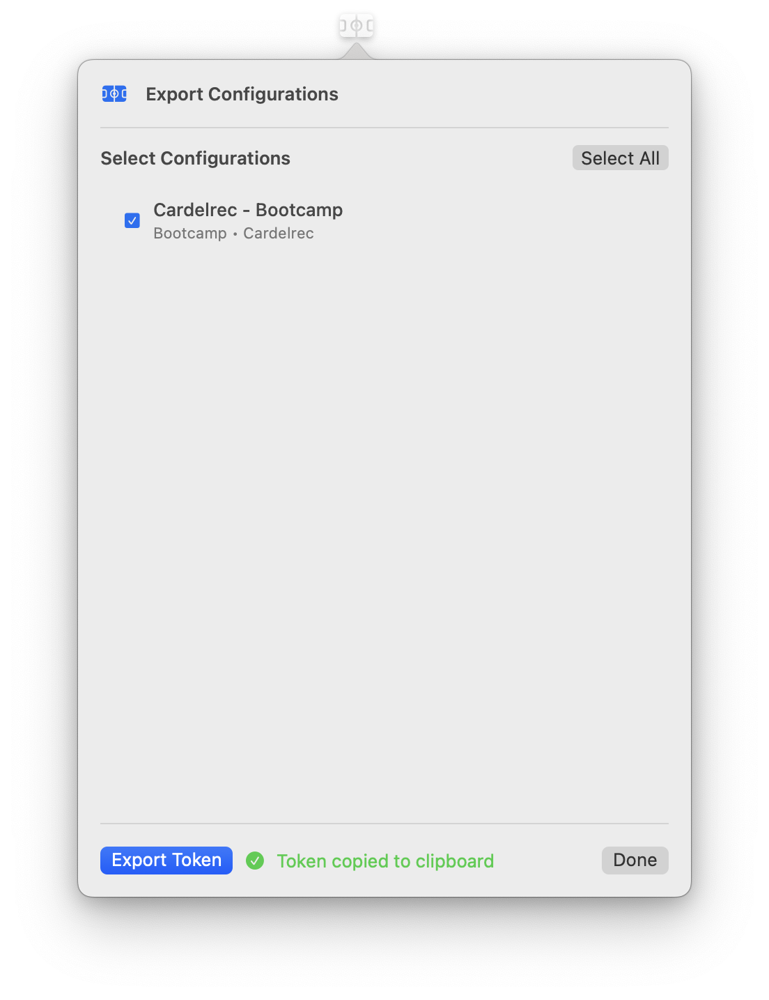

# 💻 ODYSSEY CLI Guide

The ODYSSEY CLI provides command-line automation capabilities using the same powerful WebKit automation engine as the GUI version, ensuring consistent behavior and reliability.

## ⚙️ Installation

> **Prerequisite:** First, configure the GUI app. See **[USER_GUIDE.md](USER_GUIDE.md)** for setup instructions.

1. **Download:** Download the `odyssey-cli` file from the [latest release](https://github.com/Amet13/ODYSSEY/releases/latest/).
2. **Make executable:** Run `chmod +x odyssey-cli`.
3. **Add ODYSSEY to the trust list:** Run `sudo xattr -rd com.apple.quarantine ./odyssey-cli`.

## 🔧 Export Token Details

The export token is a compressed, base64-encoded configuration containing only essential data for CLI automation:

- **User settings:** Name, phone, email credentials, IMAP server (_do not share this data, it contains sensitive information_).
- **Selected configurations:** All reservation configurations chosen for export.

## 🔧 Configuration

- **Export token from the app**

  - Open the ODYSSEY app.
  - Click the **Export** button.
  - Select configurations to be exported.
  - Click the **Export Token** button.
  - The export token will be copied to your clipboard automatically.

<div align="center">
  
</div>

- **Set up environment variable**

  ```bash
  export ODYSSEY_EXPORT_TOKEN="your_export_token_here"
  ```

- **Test the CLI**

  ```bash
  ./odyssey-cli configs
  ./odyssey-cli settings
  ```

## 🎯 Basic usage

```bash
# Set your export token
export ODYSSEY_EXPORT_TOKEN="<exported_token>"

# Run all enabled configurations
./odyssey-cli run
```

## 📋 Environment variables

| Variable               | Required | Default | Description                                                  |
| ---------------------- | -------- | ------- | ------------------------------------------------------------ |
| `ODYSSEY_EXPORT_TOKEN` | ✅ Yes   | -       | Export token from GUI containing configurations and settings |

## 🛠️ Commands

### ▶️ `run [--now] [--prior <days>]`

Run real reservations for configurations scheduled N days before reservation day using the same automation engine as the GUI app.

```bash
# Run configurations at scheduled time (6:00 PM, 2 days before event)
./odyssey-cli run

# Run configurations immediately (ignore time checks, usually for debugging)
./odyssey-cli run --now

# Run 1 day before reservation (usually for debugging)
./odyssey-cli run --prior 1
```

**Features:**

- ✅ **Real Automation**: Uses the same WebKit automation as the GUI app.
- ✅ **Parallel Execution**: Runs multiple reservations simultaneously.
- ✅ **Headless Mode**: Always runs without browser window (perfect for CI/CD).
- ✅ **Progress Tracking**: Shows real-time progress and status updates.
- ✅ **Error Handling**: Displays detailed error messages if reservation fails.
- ✅ **Timeout Protection**: 5-minute timeout to prevent hanging.

### 📋 `configs`

List all available configurations from the export token.

```bash
# Print all configurations
./odyssey-cli configs
 Available Configurations:
==================================================
1. ✅ Richcraftkanata - Aqua general - deep
   Sport: Aqua general - deep
   Facility: Richcraftkanata
   People: 1
   Time Slots:
     Tue: 9:30 AM

2. ✅ Cardelrec - Bootcamp
   Sport: Bootcamp
   Facility: Cardelrec
   People: 1
   Time Slots:
     Tue: 7:00 AM
```

### ⚙️ `settings [--unmask]`

Show user settings from export token.

```bash
# Show masked settings (default)
./odyssey-cli settings
📋 User Settings:
==================================================
Name: John
Phone: ***890
Email: ***@domain.com
IMAP Password: ***
IMAP Server: imap.domain.com

# Show unmasked settings (for debugging)
./odyssey-cli settings --unmask
📋 User Settings:
==================================================
Name: John
Phone: 1234567890
Email: johndoe@gmail.com
IMAP Password: my-s3cur3-p@ssw0rd
IMAP Server: imap.gmail.com
```

### ❓ `help`

Show CLI help and usage information.

```bash
./odyssey-cli help
```

### 📊 `version`

Show CLI version information.

```bash
./odyssey-cli version
```

## 🚀 GitHub Actions Integration

The CLI can be integrated into GitHub Actions for automated reservation booking.
Use only macOS runners.

### 📋 Step 1: Fork the Repository

1. **Fork ODYSSEY:** Go to [https://github.com/Amet13/ODYSSEY](https://github.com/Amet13/ODYSSEY) and click "Fork".
2. **Clone your fork:**

   ```bash
   git clone https://github.com/<YOUR_USERNAME>/ODYSSEY.git
   cd ODYSSEY
   ```

### 🔐 Step 2: Add GitHub Secret

1. **Go to your fork:** Navigate to your forked repository on GitHub.
2. **Settings:** Click on the "Settings" tab.
3. **Secrets:** Click on "Secrets and variables" → "Actions".
4. **New repository secret:** Click "New repository secret".
5. **Add secret:**
   - **Name:** `ODYSSEY_EXPORT_TOKEN`
   - **Value:** Your exported token from the GUI app.
6. **Save:** Click "Add secret".

### ⚙️ Step 3: Use the Workflow

The workflow file is already included in the repository. It will automatically:

- Download the latest CLI from releases.
- Run reservations using your export token.
- Upload logs for debugging.

**Refer to `.github/workflows/scheduled-reservations.yml` pipeline** for the complete automation setup.

## 🔒 Security

- Export tokens contain sensitive information (email credentials, phone numbers).
- Store tokens securely in CLI secrets.
- Never commit tokens to version control.
- Use environment variables for token storage.
- Tokens are base64-encoded and LZFSE-compressed for efficiency.
