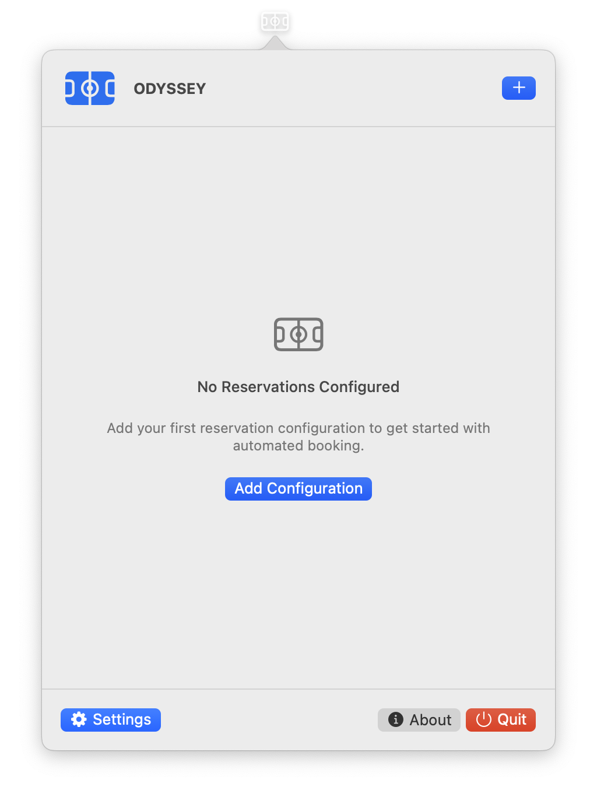

# ODYSSEY User Guide

## 📖 Table of Contents

1. [Getting Started](#getting-started)
2. [GUI Version Guide](#gui-version-guide)
3. [CLI Version](#cli-version)
4. [Configuration Management](#configuration-management)
5. [Conflict Detection](#conflict-detection)
6. [Email Setup](#email-setup)
7. [Troubleshooting](#troubleshooting)
8. [Advanced Features](#advanced-features)
9. [Security & Privacy](#security--privacy)

## 🚀 Getting Started

### ⚙️ Installation

See [INSTALLATION.md](INSTALLATION.md) for detailed installation instructions.

## 🖥️ GUI Version Guide

### 🎯 First Time Setup

1. **Launch ODYSSEY** - Click the menu bar icon
2. **Add Configuration** - Click the "+" button
3. **Configure Settings** - Set up your contact info and email
4. **Test Email** - Verify your email connection works
5. **Run Test** - Try a manual run to verify everything works

<div align="center">
  
  <p><em>Main screen when no configurations are added</em></p>
</div>

### ➕ Adding a Reservation Configuration

1. Click **Add Configuration** or the "+" button
2. Fill in the required fields:
   - **Name**: A descriptive name for your reservation
   - **Facility URL**: The Ottawa recreation facility URL
   - **Sport Name**: The sport you want to book
   - **Number of People**: How many people in your group
   - **Time Slots**: Select days and times for your reservations
3. Click **Save**

<div align="center">
  
  <p><em>Adding a new reservation configuration</em></p>
</div>

### ⚙️ Configuration Details

#### 🌐 Facility URL Format

```
https://reservation.frontdesksuite.ca/rcfs/[facility-name]
```

**Example**: `https://reservation.frontdesksuite.ca/rcfs/cardelrec`

#### 🏀 Sport Names

Common sport names include:

- Basketball
- Badminton
- Tennis
- Soccer
- and many more...

#### ⏰ Time Slots

- Select the day of the week
- Choose the time for your reservation
- You can have multiple configurations for different times

### 🔧 Managing Configurations

#### ✅ Enable/Disable

- Use the toggle switch to enable/disable automatic runs
- Disabled configurations won't run automatically

#### ✏️ Edit Configuration

- Click the pencil icon to edit a configuration
- All fields can be modified
- Changes are saved immediately

#### 🗑️ Delete Configuration

- Click the trash icon to delete a configuration
- This action cannot be undone

#### ▶️ Run Manually

- Click the play button to run a configuration immediately
- Useful for testing or immediate bookings

<div align="center">
  
  <p><em>Main screen with active configurations</em></p>
</div>

## 💻 CLI Version

For detailed CLI usage, commands, and advanced features, see **[CLI.md](CLI.md)**.

**Quick Start**:

1. Export configuration from GUI app
2. Set environment variable: `export ODYSSEY_EXPORT_TOKEN="<token>"`
3. Run: `./odyssey-cli run`

## ⚙️ Configuration Management

### 📋 Best Practices

1. **Use Descriptive Names**: Name your configurations clearly
2. **Test First**: Always run a manual test before enabling auto-run
3. **Monitor Logs**: Check Console.app for detailed logs
4. **Backup Configurations**: Export your configurations regularly

### ✅ Configuration Validation

ODYSSEY automatically validates your configurations:

- ✅ Facility URL format
- ✅ Sport name requirements
- ✅ Time slot validity
- ✅ Contact information completeness

## 🔍 Conflict Detection

ODYSSEY automatically detects potential conflicts:

### ⚠️ Conflict Types

1. **Time Slot Overlaps**: When configurations have overlapping times

### 🚦 Conflict Severity Levels

- **🔴 Critical**: Must be resolved before saving
- **🟡 Warning**: Should be reviewed
- **🔵 Information**: Informational only

### 🔧 Resolving Conflicts

1. **Review Conflicts**: Check the conflict details
2. **Modify Configurations**: Adjust times, facilities, or settings
3. **Save Anyway**: If conflicts are acceptable, you can save anyway
4. **Disable Configurations**: Turn off conflicting auto-runs

## 📧 Email Setup

### 📧 Gmail Setup (Recommended)

1. **Enable 2-Factor Authentication** on your Google account
2. **Generate App Password**:
   - Go to Google Account settings
   - Security → 2-Step Verification → App passwords
   - Generate a password for "ODYSSEY"
3. **Configure in ODYSSEY**:
   - Email: your.email@gmail.com
   - IMAP Server: gmail.com
   - Password: Your 16-character app password

Other email providers that support IMAP could be used too.

### 🧪 Testing Email Connection

1. Click **Settings** in ODYSSEY
2. Fill in your email credentials
3. Click **Test Email**
4. Check your email for the test message
5. If successful, your email is properly configured

<div align="center">
  
  <p><em>Settings screen for email configuration</em></p>
</div>

## 🔧 Troubleshooting

### ⚠️ Common Issues

#### 🔄 Automation Fails

**Symptoms**: Automation stops or shows errors
**Solutions**:

- Check your internet connection
- Verify the facility URL is correct
- Try running at a different time
- Check Console.app for detailed logs

#### 📧 Email Verification Fails

**Symptoms**: No verification emails received
**Solutions**:

- Verify your email credentials
- Check spam/junk folders
- Ensure IMAP is enabled for your email
- For Gmail, use App Password, not regular password

#### 🖥️ App Not Appearing in Menu Bar

**Symptoms**: ODYSSEY icon not visible
**Solutions**:

- Check Applications folder for ODYSSEY
- Restart the app
- Ensure macOS 15+ is installed (see [INSTALLATION.md](INSTALLATION.md))
- Check System Preferences → Dock & Menu Bar

#### 🔑 Keychain Errors

**Symptoms**: Credential storage errors
**Solutions**:

- Re-enter credentials in Settings
- Grant Keychain access when prompted
- Restart the app after updating credentials

### 🆘 Getting Help

1. **Check Logs**: Use Console.app to view detailed logs
2. **GitHub Issues**: Report bugs on [GitHub](https://github.com/Amet13/ODYSSEY/issues)
3. **Documentation**: See [DEVELOPMENT.md](DEVELOPMENT.md) for advanced troubleshooting

## 🔒 Security & Privacy

### 🛡️ Data Protection

- **Local Processing**: All automation runs on your device
- **Secure Storage**: Credentials stored in macOS Keychain
- **No External Data**: No user data sent to external servers
- **HTTPS Only**: All network requests use secure connections

### 🔒 Privacy Features

- **Masked Logs**: Sensitive data is masked in logs
- **Private Logging**: Email addresses and credentials are private
- **User Consent**: No data collection without explicit consent

### 🔐 Security Best Practices

1. **Use App Passwords**: For Gmail, use App Passwords, not regular passwords
2. **Regular Updates**: Keep ODYSSEY updated to the latest version
3. **Monitor Logs**: Regularly check Console.app for unusual activity
4. **Export Backups**: Regularly export your configurations

## 📊 Monitoring & Logs

### 📋 Viewing Logs

1. Open **Console.app** (Applications → Utilities → Console)
2. Search for `com.odyssey.app`
3. Look for emoji indicators:
   - 🚀 Success messages
   - ⚠️ Warnings
   - ❌ Errors
   - 🔍 Debug information

### 📊 Log Levels

- **Info**: General operation messages
- **Warning**: Potential issues
- **Error**: Failed operations
- **Debug**: Detailed technical information

### 🔍 Log Filtering

```bash
# Filter by subsystem
log stream --predicate 'subsystem == "com.odyssey.app"'

# Filter by category
log stream --predicate 'category == "WebKitService"'

# Filter by level
log stream --predicate 'level >= 2'
```
