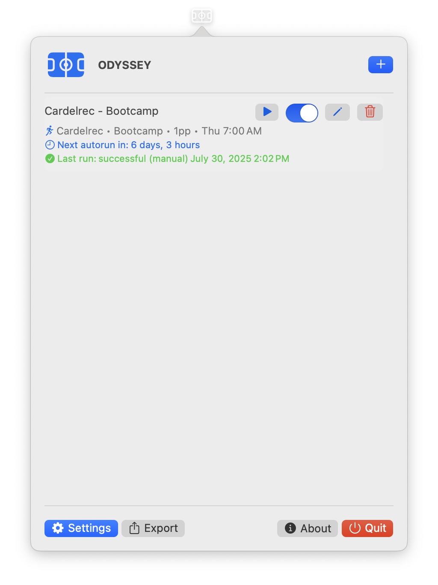

# 👤 ODYSSEY User Guide

## 📦 Installation

1. Download `ODYSSEY.dmg` file from the [latest release](https://github.com/Amet13/ODYSSEY/releases/latest/)
2. Open the installer, and drag `ODYSSEY.app` to `Applications`, eject the `.dmg` archive
3. Open the installed app, it will appear in your menu bar (tray)

For CLI installation and setup, see the complete [CLI Documentation](CLI.md).

## ⚙️ Configuration

### 🎯 First Time Setup

1. **Launch ODYSSEY** - Click the menu bar icon
2. **Add Configuration** - Click the "+" button
3. **Configure Settings** - Set up your contact info and email
4. **Test Email** - Verify your email connection works

  
  
<em>Main screen when no configurations are added</em>

### ➕ Adding a Reservation Configuration

1. Click **Add Configuration** or the "+" button
2. Fill in the required fields:
   - **Facility URL**: The facility URL in format `https://reservation.frontdesksuite.ca/rcfs/[facility-name]`
   - **Sport Name**: Select the sport
   - **Number of People**: How many people in your group
   - **Configuration Name**: You can change it if you want
   - **Time Slot**: Select day and time for your reservations
3. Click **Add**

  
  
<em>Adding a new reservation configuration</em>

### 🔧 Managing Configurations

#### ▶️ Run Manually

- Click the play button to run a configuration immediately
- Useful for testing or immediate bookings

#### ✅ Enable/Disable

- Use the toggle switch to enable/disable automatic runs (2 days prior at 6pm)
- Disabled configurations won't run automatically

#### ✏️ Edit Configuration

- Click the pencil icon to edit a configuration
- All fields can be modified
- Changes are saved immediately

#### 🗑️ Delete Configuration

- Click the trash icon to delete a configuration
- You will be asked to confirm this operation to avoid random click

  
  
<em>Main screen with active configurations</em>

### 📧 Email Setup

The app can connect to your email account using IMAP and automatically parse verification codes for approving reservation.

Gmail does not support your password usage for IMAP, that's why you need to generate [App Password](https://support.google.com/mail/answer/185833?hl=en) for it and use for ODYSSEY.

  
  
<em>Settings screen for email configuration</em>

## 📊 Logs

1. Open **Console.app** (Applications → Utilities → Console)
2. Search for `com.odyssey.app`
3. Look for emoji indicators:
   - 🚀 Success messages
   - ⚠️ Warnings
   - ❌ Errors
   - 🔍 Debug information
