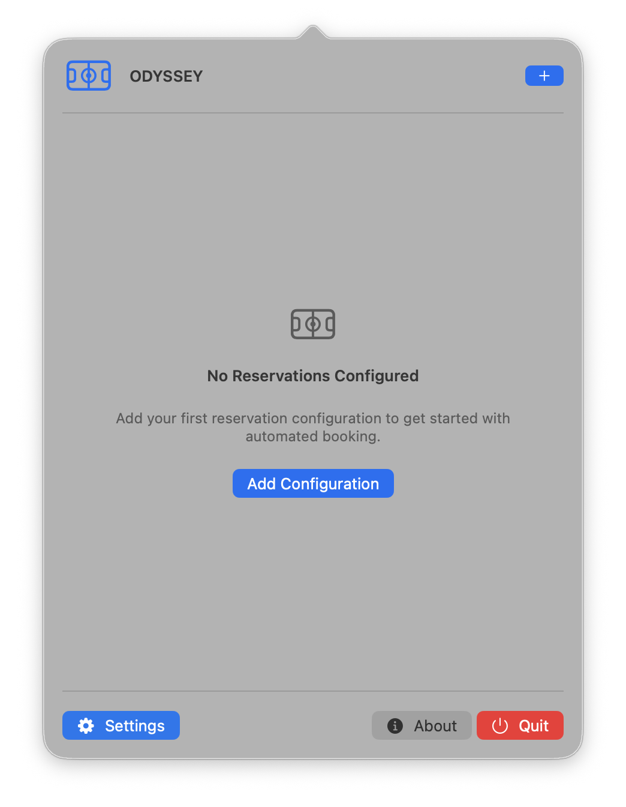
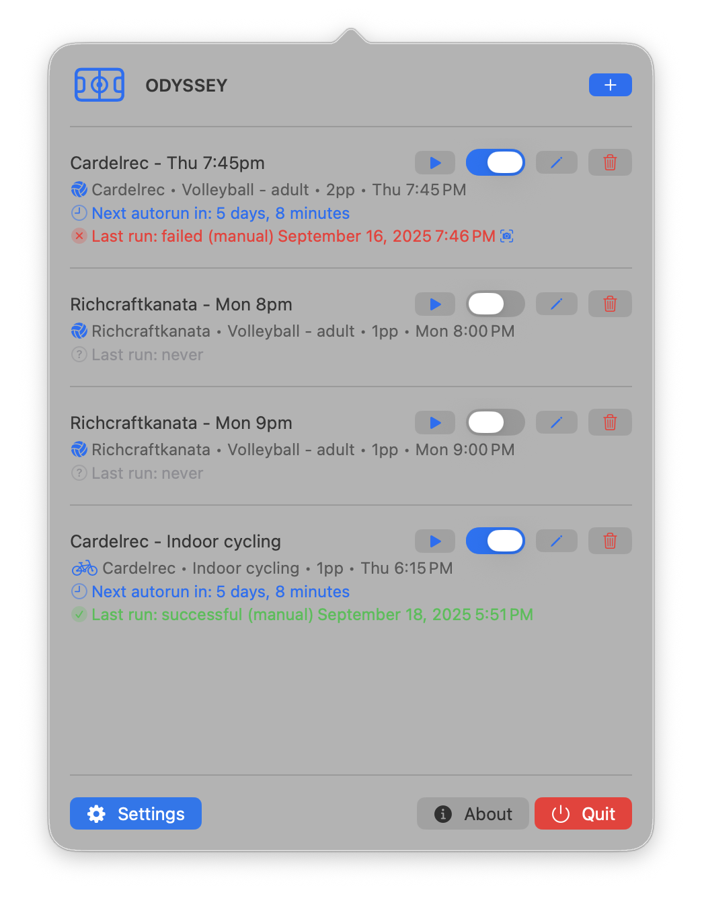

# 👤 ODYSSEY User Guide

## 📦 Installation

- **Download** the `ODYSSEY.dmg` file from the [latest release](https://github.com/Amet13/ODYSSEY/releases/latest/).
- **Install:** Open the installer and drag `ODYSSEY.app` to **Applications**. Eject the `.dmg` archive.
- **Add to the quarantine:** Run in your terminal:

  ```bash
  sudo xattr -rd com.apple.quarantine /Applications/ODYSSEY.app
  ```

- **Launch:** Open the app. You'll see a new icon in your menu bar.

## ⚙️ Configuration

<div align="center">
  
</div>

### 🎯 First-time Setup

1. **Launch ODYSSEY:** Click the menu bar icon.
2. **Add configuration:** Click the **+** or **Add Configuration** button.
3. **Configure settings:** Set up your contact info and email.
4. **Test email:** Verify your email connection works.
5. **Save the settings.**

#### 📧 Email Setup

The app can connect to your email account using IMAP and automatically parse verification codes for approving reservations.

Gmail does not support using your regular password for IMAP. You need to generate an [App Password](https://support.google.com/mail/answer/185833?hl=en) and use it with ODYSSEY.

<div align="center">
  
</div>

### ➕ Adding a Reservation Configuration

1. **Add configuration:** Click the **+** or **Add Configuration** button.
2. **Fill in the required fields:**
   - **Facility URL:** The facility URL in format `https://reservation.frontdesksuite.ca/rcfs/[facility-name]`.
   - **Sport name:** Select the sport.
   - **Number of people:** How many people in your group.
   - **Configuration name:** You can change it if you want.
   - **Time slot:** Select day and time for your reservations.
3. **Add:** Click **Add**.

<div align="center">
  
</div>

### 🔧 Managing Configurations

#### ▶️ Run Manually

- **Run:** Click the play button to run a configuration immediately.
- **Test:** Useful for testing or immediate bookings.

#### ✅ Enable/Disable

- **Toggle:** Use the toggle switch to enable or disable automatic runs (2 days prior at 6 p.m.).
- **Disabled:** Disabled configurations won't run automatically.

### 💤 Sleep and Autorun Reliability

- ODYSSEY schedules automatic runs two days prior at 6:00 p.m. If your Mac is sleeping at that time, the run may be missed.
- To ensure reliability, keep your Mac awake around 6:00 p.m. on autorun days. You can use third-party utilities such as [Caffeine](https://www.caffeine-app.net) to temporarily prevent sleep.

#### ✏️ Edit Configuration

- **Edit:** Click the pencil icon to edit a configuration.
- **Modify:** All fields can be modified.
- **Save:** Changes are saved immediately.

#### 🗑️ Delete Configuration

- **Delete:** Click the trash icon to delete a configuration.
- **Confirm:** You'll be asked to confirm this action to prevent accidental deletion.

<div align="center">
  
</div>

## ⚙️ Advanced Settings

ODYSSEY provides advanced configuration options that are always available to help you customize your automation experience.

### 🔍 Browser Window Controls

- **Show browser window:** Enable this option to make the browser window visible during automation. This can increase changes to bypass captcha and allows you to monitor the automation process.
- **Automatically close browser window on failure:** When enabled, the browser window will close automatically after a reservation failure. When disabled, the window remains open so you can inspect any errors.

### ⏰ Custom Autorun Time

- **Use custom autorun time:** Enable this to set a custom time for automatic reservation runs instead of the default 6:00 PM.
- **Autorun Time picker:** Select your preferred time using the time picker. The time will be used for all automatic reservation runs.

### 📅 Custom Prior Days

### 🔔 Notifications

ODYSSEY provides reliable, crash-safe notifications to keep you informed about the automation process. These notifications work without requiring system permissions and use multiple methods to ensure delivery.

#### ⚙️ Notification Settings

In the **Settings** → **Advanced Settings** section, you can configure:

- **Enable Notifications:** Turn all notifications on/off

#### 🔔 Notification Types

**Reservation Status:**

- **Success:** Confirmation when a reservation is successfully booked
- **Failure:** Alerts when reservations fail with error details
- **Automation Start:** Notification when the automated booking process begins
- **Automation Complete:** Summary of results after all configurations are processed

**Scheduled Reminders:**

- **Autorun Reminder:** Notification 1 hour before the scheduled automatic run (6:00 PM by default)

#### 🧪 Testing Notifications

Notifications are automatically tested when they occur during reservation automation. You can verify they're working by:

1. **Running a reservation configuration** - Success/failure notifications will appear
2. **Checking the menu bar** - Notification info appears in the title for 10 seconds

#### 🔧 How Notifications Work

ODYSSEY uses a multi-layered approach to ensure notifications are delivered:

- **Status Bar Updates:** Menu bar title shows notification info for 10 seconds
- **Alert Dialogs:** Simple macOS alerts that appear immediately
- **No Permissions Required:** Works without system notification permissions
- **Only Important Events:** Shows notifications only for reservation success, failure, and automation completion

#### ⚠️ Troubleshooting

If notifications aren't working:

1. Check that "Enable Notifications" is turned on in Advanced Settings
2. Run a reservation configuration to trigger notifications
3. Ensure the app has focus (notifications may be less visible if app is in background)
4. Notifications use safe methods that won't crash the app

- **Use custom prior days:** Enable this to customize how many days before the reservation date the automation should run (default is 2 days).
- **Prior days stepper:** Use the stepper to select between 0-7 days. This is useful for debugging, testing, or adjusting your reservation strategy.
