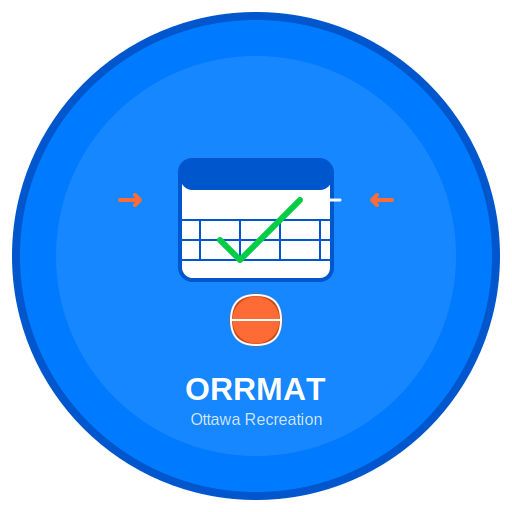

<div align="center">
  
  <h1>ODYSSEY</h1>
  <p><strong>Automated Sports Reservation Booking for Ottawa Recreation</strong></p>
  
  <p>
    <a href="https://github.com/Amet13/ODYSSEY/actions/workflows/ci.yml">
      
    </a>
    <a href="https://github.com/Amet13/ODYSSEY/blob/main/LICENSE">
      
    </a>
    <a href="https://github.com/Amet13/ODYSSEY/issues">
      
    </a>
  </p>
</div>

# 🥅 ODYSSEY - Ottawa Drop-in Your Sports & Schedule Easily Yourself

A sophisticated macOS menu bar application that automates sports reservation bookings for Ottawa Recreation facilities.

## 🚀 Features

- **Native macOS Integration**: Runs quietly in the menu bar (not dock) using `LSUIElement = true`
- **WebKit Automation**: Uses native Swift WebKit (WKWebView) for robust, native web automation
- **Modern SwiftUI Interface**: Beautiful, responsive UI for configuration management
- **Automated Scheduling**: Schedules automatic runs based on configured time slots
- **Multiple Configurations**: Support for different sports and facilities
- **God Mode**: Run multiple reservations simultaneously with separate WebKit instances
- **Comprehensive Logging**: Structured logging with emojis for easy debugging
- **Secure Storage**: Keychain integration for secure credential storage
- **Email Verification**: Automated email verification for reservation confirmations
- **Anti-Detection**: Advanced human-like behavior simulation to avoid bot detection

## 🏗️ Architecture

### Core Technologies

- **SwiftUI** - Modern, declarative UI framework for macOS
- **AppKit** - Native macOS menu bar integration via `StatusBarController`
- **WebKit (WKWebView)** - Native web automation engine for browser automation
- **Combine** - Reactive programming for async operations and state management
- **UserDefaults** - Persistent configuration storage via `ConfigurationManager`
- **Timer** - Automated scheduling system for reservation automation
- **os.log** - Structured logging for debugging and monitoring

### Key Components

1. **AppDelegate** - Application lifecycle and scheduling management
2. **StatusBarController** - Menu bar integration and UI management
3. **ConfigurationManager** - Settings and data persistence (singleton)
4. **ReservationManager** - Web automation orchestration
5. **WebKitService** - Native web automation engine (singleton)
6. **FacilityService** - Web scraping and facility data management
7. **EmailService** - IMAP integration and email testing
8. **UserSettingsManager** - User configuration and settings management
9. **ValidationService** - Centralized validation logic (singleton)
10. **AppConstants** - Centralized application constants

## 📦 Installation

### Prerequisites

- macOS 12.0 or later
- Xcode 15.0 or later (for development)
- Node.js and npm (for JavaScript linting)

### Quick Start

1. **Clone the repository**:

   ```bash
   git clone https://github.com/your-username/ODYSSEY.git
   cd ODYSSEY
   ```

2. **Build the application**:

   ```bash
   ./Scripts/build.sh
   ```

3. **Launch the app**:
   The app will appear in your menu bar. Click the ODYSSEY icon to access the interface.

### Development Setup

1. **Install dependencies**:

   ```bash
   npm install
   ```

2. **Open in Xcode**:

   ```bash
   open Config/ODYSSEY.xcodeproj
   ```

3. **Run code quality checks**:
   ```bash
   swiftlint lint
   npm run lint
   ```

## 🎯 Usage

### Basic Configuration

1. **Add a Reservation Configuration**:

   - Click the ODYSSEY menu bar icon
   - Click "Add Configuration"
   - Fill in the facility URL, sport name, and time slots
   - Configure contact information

2. **Set Up Email Verification**:

   - Enter your Gmail address
   - Generate an App Password (format: `xxxx xxxx xxxx xxxx`)
   - Test the connection

3. **Run Reservations**:
   - **Manual Run**: Click "Run Now" for immediate execution
   - **Automatic**: Enable automatic scheduling
   - **God Mode**: Run multiple configurations simultaneously

### Advanced Features

- **Debug Window**: Monitor WebKit automation in real-time
- **Logging**: View detailed logs with emoji indicators
- **Error Handling**: Comprehensive error recovery and reporting
- **Anti-Detection**: Human-like behavior simulation

## 🔧 Configuration

### Facility URLs

Supported Ottawa Recreation facilities:

- Various Ottawa recreation centers
- Compatible with the Ottawa recreation booking system

### Time Slots

Configure multiple time slots for different days:

- Select specific days of the week
- Set preferred time ranges
- Configure group sizes

### Email Settings

- **Gmail**: Use App Passwords for secure access
- **IMAP**: Standard IMAP server configuration
- **Verification**: Automated email verification code parsing

## 🛡️ Security & Privacy

- **Local Processing**: All automation runs locally on your machine
- **Secure Storage**: Credentials stored in macOS Keychain
- **No Data Transmission**: No user data sent to external servers
- **Privacy Protection**: Sensitive data masked in logs

## 🐛 Troubleshooting

### Common Issues

1. **WebKit Crashes**: The app automatically recovers from WebKit crashes
2. **Email Verification**: Ensure App Password format is correct
3. **Timeouts**: Check network connection and facility availability
4. **Debug Window**: Use the debug window to monitor automation progress

### Logs

View detailed logs in Console.app:

- Filter by subsystem: `com.odyssey.app`
- Look for emoji indicators for quick status identification

## 🤝 Contributing

See [CONTRIBUTING.md](Documentation/CONTRIBUTING.md) for detailed contribution guidelines.

### Development Guidelines

- Follow Swift style guide and SwiftLint rules
- Use emojis in log messages for better readability
- Add comprehensive documentation for new features
- Test thoroughly before submitting changes

## 📄 License

This project is licensed under the MIT License - see the [LICENSE](LICENSE) file for details.

## 🙏 Acknowledgments

- Ottawa Recreation for providing the booking system
- The Swift and WebKit communities for excellent documentation
- Contributors and testers who help improve the application

## 📞 Support

- **Issues**: [GitHub Issues](https://github.com/your-username/ODYSSEY/issues)
- **Discussions**: [GitHub Discussions](https://github.com/your-username/ODYSSEY/discussions)
- **Documentation**: [Documentation/](Documentation/)

---

**Note**: This application is designed to help the Ottawa sports community by automating routine reservation tasks. Always respect the terms of service of the facilities you're booking with.
