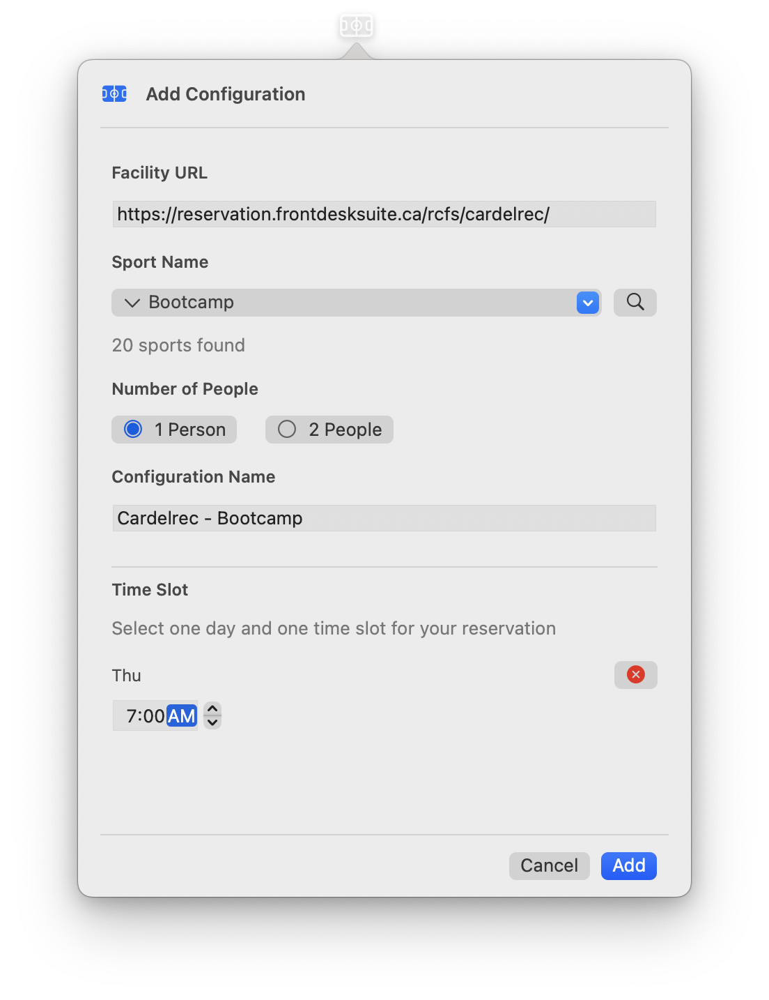
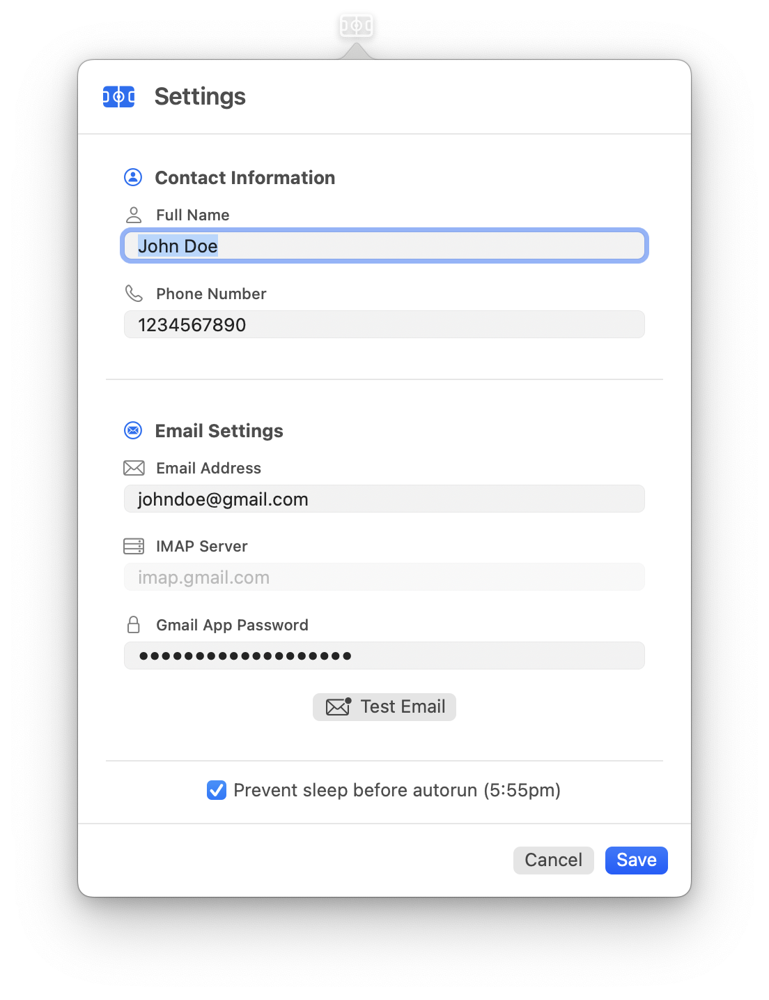
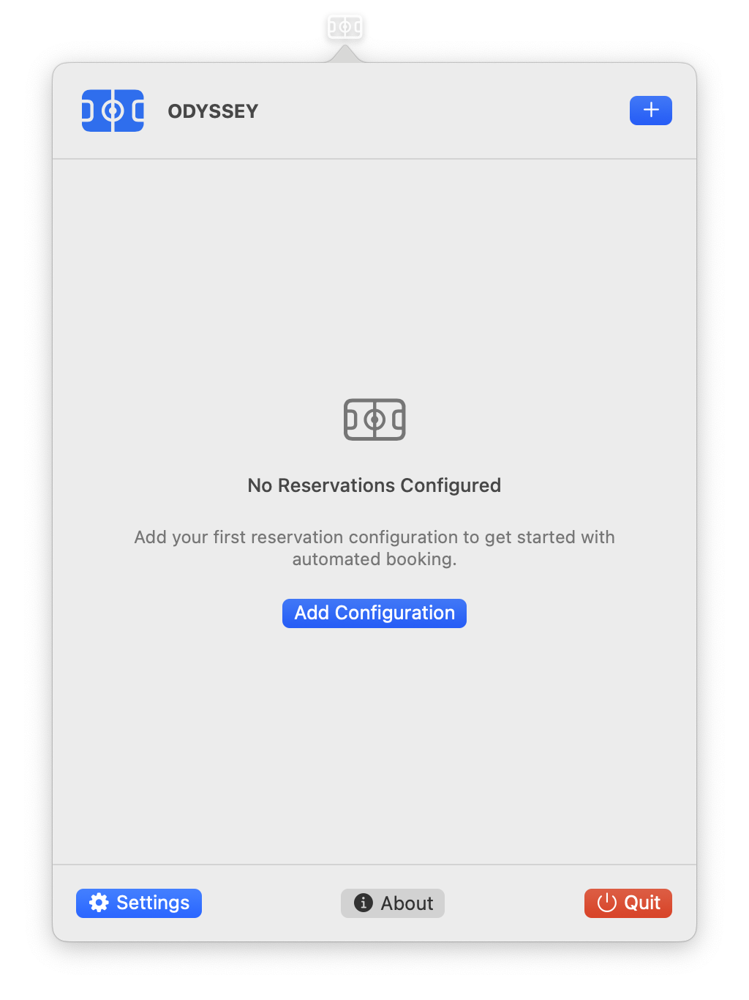
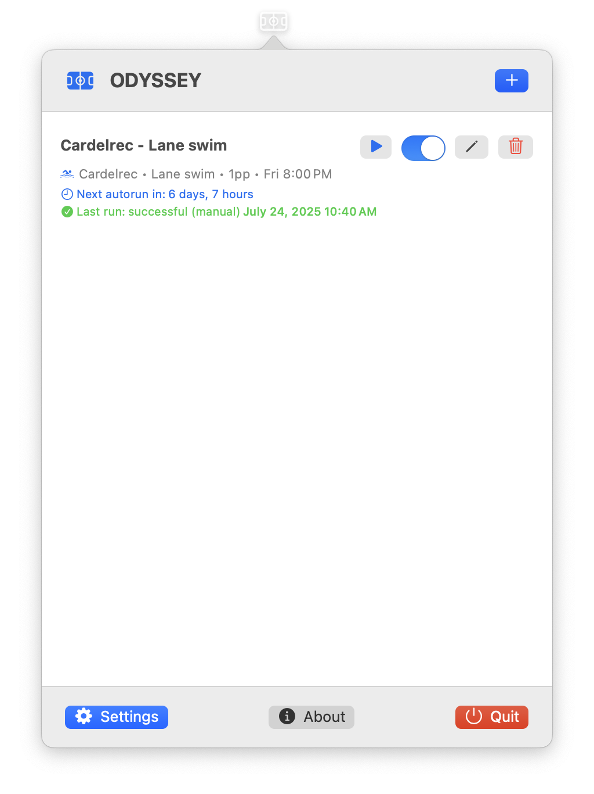

  
  <h1>ODYSSEY</h1>
  
<strong>Ottawa Drop-in Your Sports & Schedule Easily Yourself</strong>

  

    
    
    
  

## 🚀 Quick Start

1. **Download** the latest `.dmg` from the [Releases page](https://github.com/Amet13/ODYSSEY/releases).
2. **Install**: Open the `.dmg`, drag ODYSSEY to `Applications`.
3. **Launch**: Find ODYSSEY in your menu bar (top right).
4. **Configure**: Click the icon, add your reservation details, and set up email for verification.
5. **Automate!** Sit back and let ODYSSEY book your sports for you! 🎉

## ✨ Features

| Feature                     | Description                                                                                     |
| --------------------------- | ----------------------------------------------------------------------------------------------- |
| 🖥️ Native macOS Integration | Runs quietly in the menu bar, not the Dock                                                      |
| 🛡️ WebKit Automation        | Uses native Swift WebKit (WKWebView) for robust automation                                      |
| 🎨 Modern SwiftUI Interface | Beautiful, responsive UI for easy configuration                                                 |
| ⏰ Automated Scheduling     | Schedules runs based on your configured time slots                                              |
| ⚙️ Multiple Configurations  | Supports different sports and facilities                                                        |
| 🔒 Secure Storage           | Keychain integration for credentials                                                            |
| 📧 Email Verification       | Automated IMAP/Gmail verification for reservation confirmations                                 |
| 🕵️‍♂️ Anti-Detection           | Human-like automation to avoid bot detection                                                    |
| 🛎️ Native Notifications     | Get macOS notifications for reservation success, failures, upcoming autoruns, and system errors |
| 🎨 Dark Mode Polish         | Fully adaptive UI for both light and dark appearances                                           |
| 🥚 Easter Eggs              | Discover hidden features and fun surprises for power users                                      |

## 📦 Installation

1. **Download the latest release**:
   - Go to the [Releases page](https://github.com/Amet13/ODYSSEY/releases).
   - Download the latest `.dmg` installer for your macOS version.
2. **Install the app**:
   - Open the downloaded `.dmg` file.
   - Drag the ODYSSEY app to your `Applications` folder.
   - Eject the ODYSSEY disk image.
3. **Launch ODYSSEY**:
   - Open your `Applications` folder and double-click ODYSSEY.
   - The app will appear in your menu bar (top right of your screen).
4. **Initial Setup**:
   - Click the ODYSSEY menu bar icon.
   - You're ready to automate your bookings! 🎾

## 🎯 Usage

### 1️⃣ Add a Reservation Configuration

- Click the ODYSSEY menu bar icon
- Click **Add Configuration** or **+** button
- Fill in the facility URL, select sport name, and daytime slot

  

### 2️⃣ Set Up Contact Data

- Click **Settings**
- Fill in your name and phone
- Fill in your email credentials
- Click **Test Email**
- Configure your preferences and test email connection

  

### 3️⃣ Configure Reservations

- **Manual Run**: Click **Run Now** for immediate execution
- **Auto Run**: Enable toggle; runs at 6PM, 2 days before your event
- **Edit Configuration** (optional)
- **Delete Configuration** (optional)

  
  

> **💡 Tip**: Keep your laptop awake during reservation automation. While ODYSSEY can prevent sleep before autorun, it's best to ensure your Mac doesn't go to sleep during the reservation process for optimal reliability.

## 📊 Logs & Debugging

- View detailed logs in **Console.app**:
  - Filter by subsystem: `com.odyssey.app`
  - Look for emoji indicators for quick status identification
- All sensitive data is masked or marked as private in logs

## 🛠️ Troubleshooting & FAQ

### Common Issues

#### ❌ Automation fails with reCAPTCHA or bot detection

- Try running the app at a different time or with a different network
- Make sure your configuration matches the facility's current website structure
- For advanced troubleshooting, see the [developer documentation](Documentation/DEVELOPMENT.md)

#### 📧 Email verification not working

- Double-check your IMAP/Gmail credentials and App Password (for Gmail)
- Test your email connection in Settings
- Check for typos in your email address or server
- For Gmail, ensure 2FA is enabled and you are using an [App Password](https://support.google.com/accounts/answer/185833?hl=en)

#### 🔒 Keychain or credential errors

- If you see a Keychain error banner, try re-entering your credentials in Settings
- Make sure you have granted Keychain access to ODYSSEY
- Restart the app after updating credentials

#### 🕵️‍♂️ App does not appear in menu bar

- Ensure you are running macOS 15.0 or later
- Check that the app is not running in the Dock (it should only appear in the menu bar)

#### 📝 Logs not showing in Console.app

- Search for `ODYSSEY` or `com.odyssey.app` in Console
- Make sure logging is enabled in your system settings

### Where to Get Help

- [GitHub Issues](https://github.com/Amet13/ODYSSEY/issues)
- See the [full documentation](Documentation/DEVELOPMENT.md) for advanced troubleshooting

## 🤝 Contributing

See [CONTRIBUTING.md](Documentation/CONTRIBUTING.md) for detailed contribution guidelines, and good first issues.

## 🛡️ Security & Compliance

- 🔒 Credentials are securely stored in the macOS Keychain—never in plain text or UserDefaults
- 🌐 All network requests use HTTPS; App Transport Security (ATS) is strictly enforced
- 📝 The app is code signed for distribution, but is **not notarized by Apple** (no Apple Developer account). To enable notarization, see [DEVELOPMENT.md](Documentation/DEVELOPMENT.md) and `Scripts/create-release.sh`
- 🚫 No user data is ever sent externally without your explicit consent. All automation runs locally
- See [DEVELOPMENT.md](Documentation/DEVELOPMENT.md) for full security and compliance details

## 📄 License

This project is licensed under the MIT License - see the [LICENSE](LICENSE) file for details.
