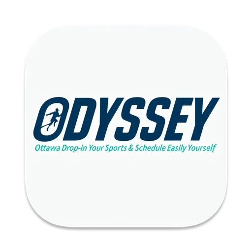

  
  <h1>ODYSSEY</h1>
  
<strong>Ottawa Drop-in Your Sports & Schedule Easily Yourself</strong>

  
<em>macOS Menu Bar App + Command Line Interface for Sports Reservation Automation</em>

  

    
    
    
  

## 🚀 Quick Start

1. **Download** the `ODYSSEY.dmg` file from the [latest release](https://github.com/Amet13/ODYSSEY/releases/latest/).
2. **Install:** Open the installer and drag `ODYSSEY.app` to **Applications**.
3. **Add ODYSSEY to the trust list:** Run `sudo xattr -rd com.apple.quarantine /Applications/ODYSSEY.app` in your terminal.
4. **Launch:** Open the app. You'll see a new "Sports Court" icon in your menu bar.
5. **Configure:** Click the icon to add your settings and create your first configuration.
6. **Automate!** Enable autorun, or run it manually, and let ODYSSEY book your sports for you! 🎉

## ✨ Key Features

- 🖥️ **GUI & CLI versions** – Menu bar app + command-line automation.
- 🛡️ **Native WebKit automation** – Robust, human-like browser automation.
- ⏰ **Smart scheduling** – Automated runs based on your time slots.
- 🔒 **Secure & private** – Local processing, Keychain storage, no external data.
- 📧 **Email integration** – Automated verification and confirmations.
- 🎨 **Modern interface** – Beautiful SwiftUI with dark mode support.

## 📚 Documentation

- **Start here** → **[USER_GUIDE.md](Documentation/USER_GUIDE.md)** – Complete app setup and usage guide.
- **For automation** → **[CLI.md](Documentation/CLI.md)** – Command-line interface for CI/CD and remote automation.
- **For developers** → **[DEVELOPMENT.md](Documentation/DEVELOPMENT.md)** – Development workflow and contribution guidelines.

## ⚖️ Ethical Considerations & Legal Notice

### 🛡️ Responsible Usage Guidelines

**IMPORTANT:** This tool is designed to assist with legitimate reservation booking only. Users must:

- ✅ **Use responsibly** - Only automate bookings for yourself and your legitimate group members.
- ✅ **Respect rate limits** - The app includes built-in delays to avoid overwhelming servers.

### 🚫 Prohibited Uses

**DO NOT:**

- ❌ Use for commercial booking services or reselling reservations.
- ❌ Share accounts or credentials with others.
- ❌ Use for any malicious or harmful purposes.

### 📋 Legal Disclaimer

This software is provided "as is" without warranty. Users are responsible for:

- Ensuring compliance with Ottawa Recreation's terms of service.
- Respecting booking policies and limitations.
- Using the application in accordance with applicable laws.
- Understanding that automation may be subject to website terms of service.

### 🔒 Privacy & Security

- All automation runs locally on your machine.
- No user data is transmitted to external servers.
- Credentials are stored securely in macOS Keychain.
- No tracking or analytics are collected.

**By using this application, you acknowledge that you understand and agree to these terms of use.**

## 📄 License

This project is licensed under the MIT License. See the [LICENSE](LICENSE) file for details.
