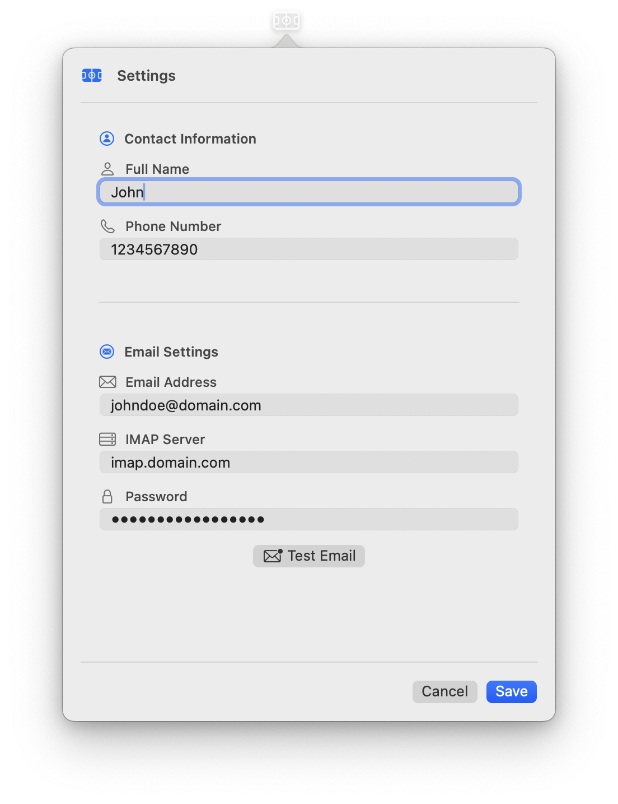

  
  <h1>ODYSSEY</h1>
  
<strong>Ottawa Drop-in Your Sports & Schedule Easily Yourself</strong>

  
  

    
    
    
    
  

A sophisticated macOS menu bar application that automates sports reservation bookings for Ottawa Recreation facilities.

## 🚀 Features

- **Native macOS Integration**: Runs quietly in the menu bar
- **WebKit Automation**: Uses native Swift WebKit (WKWebView) for robust, native web automation
- **Modern SwiftUI Interface**: Beautiful, responsive UI for configuration management
- **Automated Scheduling**: Schedules automatic runs based on configured time slots
- **Multiple Configurations**: Support for different sports and facilities
- **Secure Storage**: Keychain integration for secure credential storage
- **Email Verification**: Automated email verification for reservation confirmations (IMAP and Gmail)
- **Anti-Detection**: Advanced human-like behavior simulation to avoid bot detection

## 🖼️ Screenshots

  
  
  
  

## 🏗️ Architecture Diagram

If the diagram above does not render, see [architecture.png](Documentation/Images/architecture.png).

## 📦 Installation

1. **Download the latest release**:

   - Go to the [Releases page](https://github.com/Amet13/ODYSSEY/releases) on GitHub.
   - Download the latest `.dmg` installer for your macOS version.

2. **Install the app**:

   - Open the downloaded `.dmg` file.
   - Drag the ODYSSEY app to your `Applications` folder.
   - Eject the ODYSSEY disk image.

3. **Launch ODYSSEY**:

   - Open your `Applications` folder and double-click ODYSSEY.
   - The app will appear in your menu bar (top right of your screen).

4. **Initial Setup**:
   - Click the ODYSSEY menu bar icon.
   - Add your reservation configurations and contact information.
   - Set up your email (IMAP or Gmail) for verification codes.
   - Test your email connection in Settings.
   - You're ready to automate your bookings!

---

### For Developers

See [DEVELOPMENT.md](Documentation/DEVELOPMENT.md) for build and development setup instructions.

## 🎯 Usage

### Basic Configuration

1. **Add a Reservation Configuration**:

   - Click the ODYSSEY menu bar icon
   - Click "Add Configuration"
   - Fill in the facility URL, sport name, and time slots
   - Configure contact information

2. **Set Up Contact Data**:

   - Enter your phone, name
   - Enter your IMAP/Gmail settings
   - Test Email connection

3. **Run Reservations**:

   - **Manual Run**: Click "Run Now" for immediate execution
   - **Automatic**: Will be executed exactly at 6PM, 2 days prior to the event

4. **Browser Windows**:

> **Important:**
> To avoid Google reCAPTCHA and other anti-bot detection, browser windows must remain visible during automation. Hiding or minimizing these windows may increase the risk of being flagged as a bot and cause reservations to fail. The automation simulates real user activity in a visible window for maximum reliability.

### Logs

View detailed logs in Console.app:

- Filter by subsystem: `com.odyssey.app`
- Look for emoji indicators for quick status identification

## 📝 How to Check Logs

- Open **Console.app** (in Applications > Utilities)
- Search for `ODYSSEY` or `com.odyssey.app`
- Look for log messages with emojis for quick status identification
- Sensitive data is masked or marked as private in logs

## 🐞 How to Report Bugs

1. Go to [GitHub Issues](https://github.com/Amet13/ODYSSEY/issues)
2. Click 'New Issue' and use the bug report template
3. Include:
   - Steps to reproduce
   - Expected vs actual behavior
   - macOS version, ODYSSEY version, Xcode version
   - Relevant logs (from Console.app)
   - Screenshots if possible

---

## 🤝 Contributing

See [CONTRIBUTING.md](Documentation/CONTRIBUTING.md) for detailed contribution guidelines.

## 🛡️ Security & Compliance

- Credentials are securely stored in the macOS Keychain—never in plain text or UserDefaults.
- All network requests use HTTPS; App Transport Security (ATS) is strictly enforced.
- The app is code signed for distribution, but is **not notarized by Apple** (no Apple Developer account). To enable notarization, see [DEVELOPMENT.md](<(Documentation/DEVELOPMENT.md)>) and `Scripts/create-release.sh`.
- No user data is ever sent externally without your explicit consent. All automation runs locally.
- See [DEVELOPMENT.md](Documentation/DEVELOPMENT.md) for full security and compliance details.

## 💬 Support

- [GitHub Issues](https://github.com/Amet13/ODYSSEY/issues)

## 📄 License

This project is licensed under the MIT License - see the [LICENSE](LICENSE) file for details.

## 🛠️ Troubleshooting & FAQ

### Common Issues

- **Automation fails with reCAPTCHA or bot detection**

  - Ensure browser windows remain visible during automation (do not minimize or hide).
  - Try running the app at a different time or with a different network.
  - Make sure your configuration matches the facility's current website structure.

- **Email verification not working**

  - Double-check your IMAP/Gmail credentials and App Password (for Gmail).
  - Test your email connection in Settings.
  - Check for typos in your email address or server.
  - For Gmail, ensure 2FA is enabled and you are using an App Password.

- **Keychain or credential errors**

  - If you see a Keychain error banner, try re-entering your credentials in Settings.
  - Make sure you have granted Keychain access to ODYSSEY.
  - Restart the app after updating credentials.

- **App does not appear in menu bar**

  - Ensure you are running macOS 15.0 or later.
  - Check that the app is not running in the Dock (it should only appear in the menu bar).

- **Logs not showing in Console.app**
  - Search for `ODYSSEY` or `com.odyssey.app` in Console.
  - Make sure logging is enabled in your system settings.

### Where to Get Help

- [GitHub Issues](https://github.com/Amet13/ODYSSEY/issues)
- See the [full documentation](Documentation/DEVELOPMENT.md) for advanced troubleshooting.
